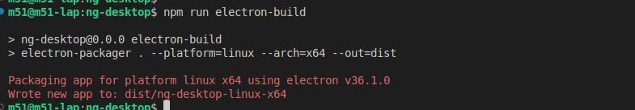
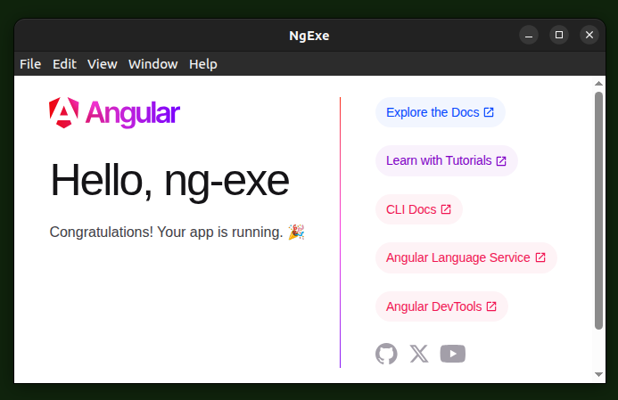
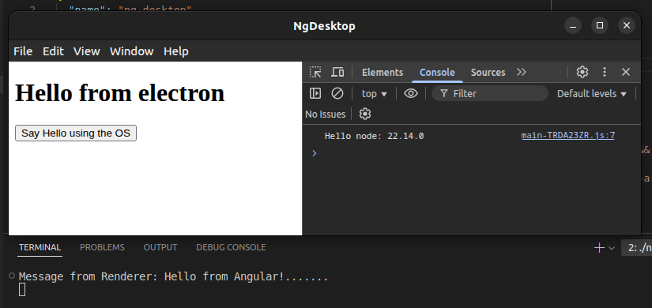

# Using Electron

Here I explain how to create an .exe using an angular project, using electron.

- [Using Electron](#using-electron)
  - [Resources](#resources)
  - [My versions](#my-versions)
  - [How It Works](#how-it-works)
  - [Pitfalls](#pitfalls)
    - [fs.existsSync](#fsexistssync)
    - [How to use the electron-packager command](#how-to-use-the-electron-packager-command)
  - [Creating new project](#creating-new-project)
    - [Create project and install Dependencies](#create-project-and-install-dependencies)
    - [Prepare Electron](#prepare-electron)
    - [Explication build exe process](#explication-build-exe-process)
    - [Adding scripts for building](#adding-scripts-for-building)
    - [Folder Structure and package dependencies versions](#folder-structure-and-package-dependencies-versions)
    - [Building](#building)
    - [Result: Creating new project](#result-creating-new-project)
  - [Using Electro API](#using-electro-api)
    - [Result: Using Electron API](#result-using-electron-api)
  - [Using the .zip file](#using-the-zip-file)

<!--

■■■■■■■■■■■■■■■■■■■■■■■■■■■■■■■■■■■■■■■■■■■■■■■■■■■■■■■■■■■■■■■■■■■■■■■■■■■■■■■■

-->

----

<!--

■■■■■■■■■■■■■■■■■■■■■■■■■■■■■■■■■■■■■■■■■■■■■■■■■■■■■■■■■■■■■■■■■■■■■■■■■■■■■■■■

-->

## Resources

- [Electron Doc](https://www.electronjs.org/docs/latest/)
- [ElectronForge Doc](https://www.electronforge.io/cli)
- [Code compressed](./refs/compressed/ng-desktop.zip)

## My versions

- `S.O:` -> Ubuntu 22.04 LTS
- `node -v` -> v20.16.0
- `ng --version` -> 19.2.10

## How It Works

**The 'file:' protocol**, `http:` protocol is replaced to load files from a server
to the client computer using this file protocol.

`<base href="./">` is important, so the other loads that come after the index.html
are treated with the file protocol.

**DevMode and distribution mode** when we are developing is convenient to load
our app from our localhost server, to take advantage of the hot reloading, and
debugging tools. But **be careful** of not building the .exe trying to load from
the localhost because it will not work, because for distribution we need to load
our app from the file protocol,

## Pitfalls

### fs.existsSync

It seems that `fs.existsSync` checking this cause an error on BrowserWindow.loadURL
of can't find the index.html.

```js
const myUrl = url.format({ pathname: path.join(__dirname, "/index.html"), protocol: "file:", slashes: true });

if(!fs.existsSync(myUrl)) {               // <------------ It caused me problems
  throw new Error("Index not found");
}
win.loadURL(myUrl);
```

### How to use the electron-packager command

I wasn't aware that the first parameter is the folder to copy, so electron load
the web app from `{.exe-folder}/resources/app/`, and instead was coping me the
source code which is incorrect, and we need to load the bundle.

```shell
npx electron-packager ./dist/{my-bundle-folder}/ --platform=...
```

----

<!--

■■■■■■■■■■■■■■■■■■■■■■■■■■■■■■■■■■■■■■■■■■■■■■■■■■■■■■■■■■■■■■■■■■■■■■■■■■■■■■■■

-->

----

<!--

■■■■■■■■■■■■■■■■■■■■■■■■■■■■■■■■■■■■■■■■■■■■■■■■■■■■■■■■■■■■■■■■■■■■■■■■■■■■■■■■

-->

----

## Creating new project

### Create project and install Dependencies

```shell
ng new ng-exe --style scss --ssr false  --interactive false && \
cd ng-exe && \
npm install electron --save-dev && \
npm install electron-packager --save-dev && \
npm install copyfiles --save-dev && \
echo -en "\007"
```

### Prepare Electron

Create `./src-desktop/main.ts`

```js
const { app, BrowserWindow, ipcMain } = require('electron/main');
const path = require('node:path');
//const fs = require('fs');
const url = require("url");


try {
  app.on("ready", createWindow);

  app.on('window-all-closed', () => {
      if (process.platform !== 'darwin') {
        app.quit();
      }
  });

  app.on('activate', () => {
      if (BrowserWindow.getAllWindows().length === 0) {
        createWindow();
      }
  });

  process.on('uncaughtException', (error) => {
      console.error("Unexpected error: ", error);
  });

  ipcMain.on('message', (event: any, message: string) => {
    console.log("Message from Renderer:", message);
  });

} catch (error) {
  console.warn("Main Caught", error);
}

// Definitions -----------------------------------------------------------------

function createWindow() {
  const args = process.argv.slice(1);
  const serve = args.some(val => val === '--serve');

  const win = new BrowserWindow( { width: 800, height: 600 } );

  const myUrl = buildUrl();

  win.webContents.on('did-fail-load', () => win.loadURL(myUrl));

  //make this check seems to cause an error on BrowserWindow.loadURL
  //if(!fs.existsSync(myUrl)) { throw new Error("Index not found"); }

  win.loadURL(myUrl);
  console.log("URL loaded", myUrl);
}

function buildUrl(): string {
  return url.format({
    pathname: path.join(__dirname, "/index.html"),
    protocol: "file:",
    slashes: true
  });
}

async function onFailReload(err: any) {
  console.log("refresh fail");
  await app.loadURL(url);
}
/*
**Importan:** Confirm that:
  - `__dirname` will give the path of the bundle in my case `./dist/ng-desktop/browser/`.
  - it's at the level of the index.html
*/
```

### Explication build exe process

1, Build the bundle defining the base url `ng serve --base-href ./`.  
2, Compile the typescript files which will execute electron.  
3, Copy the package.json in the bundle because `electron-packager` requires it.  
4, build the .exe with `electron-packager`.

### Adding scripts for building

In package.json add the following.

- update `build` to include the `--base-href ./` in the building.

- Add `"main": "main.js"` to indicate the entry point of electron.

- Add `build-electron-node` to trans-compile the folder `src-desktop/` and include them in the bundle.

- Add `copy-req-files` to copy the package.json required by electron-packager.

- Add `electron-build-exe` to create the .exe using electron-packager.

- Add `electron-build` to put all the required steps in just one command.

- Check if you changed the name of the project check that the folders match.

```json
/* package.json */
{
  "name": "ng-exe",
  "main": "main.js",
  ...
  "scripts": {
    "build": "ng build --base-href ./",

    "electron-build": "npm run build && npm run copy-req-files && npm run build-electron-node && npm run electron-build-exe",
    "electron-build-exe": "npx electron-packager ./dist/ng-exe/browser/ --platform=linux --arch=x64 --out=dist --publish=never",
    "copy-req-files": "npx copyfiles ./package.json ./dist/ng-exe/browser/",
    "build-electron-node": "tsc ./src-desktop/* --outDir ./dist/ng-exe/browser/"
  },
}
```

### Folder Structure and package dependencies versions

```shell
.
├── src/                        # <---------------- Angular code (bundle source)
│   ├── app/
│   │   ├── app.component.html
│   │   ├── app.component.scss
│   │   ├── app.component.spec.ts
│   │   ├── app.component.ts
│   │   ├── app.config.ts
│   │   └── app.routes.ts
│   ├── index.html
│   ├── main.ts
│   └── styles.scss
│
│
│
├── src-desktop/                            # <---------------- Electron scripts
│   ├── main.ts
│   └── preload.ts
│
│
│
├── dist/
│   ├── ng-desktop/
│   │   ├── browser/                               # <---------- original bundle
│   └── ng-desktop-linux-x64/
│       ├── resources/              
│       │   └── app/                                # <---------- copied bundled
│       │       ├── favicon.ico
│       │       ├── index.html
│       │       ├── main.js        # <---------- Electron scripts trans-compiled
│       │       ├── main-TRDA23ZR.js
│       │       ├── package.json
│       │       ├── polyfills-FFHMD2TL.js
│       │       ├── preload.js
│       │       └── styles-5INURTSO.css
│       └── ng-desktop #.exe                        <---------------- Executable 
│
├── angular.json
├── package.json
├── tsconfig.app.json
├── tsconfig.json
└── tsconfig.spec.json

# -----------------------------  ----------------------- --------------------
  "dependencies": {
    "@angular/common": "^19.2.0",
    "@angular/compiler": "^19.2.0",
    "@angular/core": "^19.2.0",
    "@angular/forms": "^19.2.0",
    "@angular/platform-browser": "^19.2.0",
    "@angular/platform-browser-dynamic": "^19.2.0",
    "@angular/router": "^19.2.0",
    "rxjs": "~7.8.0",
    "tslib": "^2.3.0",
    "zone.js": "~0.15.0"
  },
  "devDependencies": {
    "@angular-devkit/build-angular": "^19.2.10",
    "@angular/cli": "^19.2.10",
    "@angular/compiler-cli": "^19.2.0",
    "@types/jasmine": "~5.1.0",
    "copyfiles": "^2.4.1",
    "electron": "^36.1.0",
    "electron-packager": "^17.1.2",
    "jasmine-core": "~5.6.0",
    "karma": "~6.4.0",
    "karma-chrome-launcher": "~3.2.0",
    "karma-coverage": "~2.2.0",
    "karma-jasmine": "~5.1.0",
    "karma-jasmine-html-reporter": "~2.1.0",
    "typescript": "~5.7.2"
  }
```

### Building

Check if it builds fine the desktop executable, which should open the same windows

```bash
npm run electron-build

# --platform=win32 | linux | mac
# --arch=x64 
```



### Result: Creating new project

We should have the executable `./dist/ng-exe-linux-x64/ng-exe`, that should open.



<!--

■■■■■■■■■■■■■■■■■■■■■■■■■■■■■■■■■■■■■■■■■■■■■■■■■■■■■■■■■■■■■■■■■■■■■■■■■■■■■■■■

-->

----

<!--

■■■■■■■■■■■■■■■■■■■■■■■■■■■■■■■■■■■■■■■■■■■■■■■■■■■■■■■■■■■■■■■■■■■■■■■■■■■■■■■■

-->

## Using Electro API

**Context:** We are going to add access to the Electron API to our angular App,
in this case a log message in the node console, and access to node info from angular.

Create `src-desktop/preload.ts`

```js
const { contextBridge, ipcRenderer } = require('electron/renderer')

contextBridge.exposeInMainWorld('electronAPI', {
  sendMessage: (message: string) => ipcRenderer.send('message', message),
  versions: () => "Versions: Node: " + process.versions.node + "Chrome: " + process.versions['chrome'] + "Electron: " +  process.versions['electron']
})
```

Create `src-desktop/main.ts`

```js
...
const win = new BrowserWindow({
  width: 800,
  height: 600,
  webPreferences: {
    preload: path.join(__dirname, 'preload.js'),    // <---------------- add preload script
    //nodeIntegration: true,
    //allowRunningInsecureContent: (serve),
    //contextIsolation: true,
  },
});
...
```

Update `src/app/app.config.ts`

```ts
declare global {
  interface Window {
  electronAPI: {
    sendMessage: (message : string) => void;
    versions: () => string;
  }
  }
}

export const appConfig: ApplicationConfig = { ... }
```

Update `src/app/app.component.ts`

```ts
import { Component } from '@angular/core';
//import { RouterOutlet } from '@angular/router';

@Component({
  selector: 'app-root',
  imports: [],
  templateUrl: './app.component.html',
  styleUrl: './app.component.scss'
})

export class AppComponent {

  sendMessage() {
    window.electronAPI.sendMessage("Hello from Angular!");
    console.log("Hello node: " + window.electronAPI.versions());
  }

}

```

Update `src/app/app.component.html`

```html
<h1>Hello from electron</h1>
<div>
  <button (click)="sendMessage()">Say Hello using the OS</button>
</div>
```

### Result: Using Electron API 

```bash
npm run electron-build

# execute  ./dist/ng-exe-linux-x64/ng-exe

```

Result: If you press the button it should print a message in the console of node.



----

<!--

■■■■■■■■■■■■■■■■■■■■■■■■■■■■■■■■■■■■■■■■■■■■■■■■■■■■■■■■■■■■■■■■■■■■■■■■■■■■■■■■

-->

----

<!--

■■■■■■■■■■■■■■■■■■■■■■■■■■■■■■■■■■■■■■■■■■■■■■■■■■■■■■■■■■■■■■■■■■■■■■■■■■■■■■■■

-->

----

## Using the .zip file

1. Extract `ng-desktop.zip`

2. Get in the extracted folder `cd ng-desktop`

3. Install dependencies `npm install`

4. Build .exe `npm run electron-build`

5. Check if it executes fine (it should open the window showing the button) `./dist/ng-desktop-linux-x64/ng-desktop`

